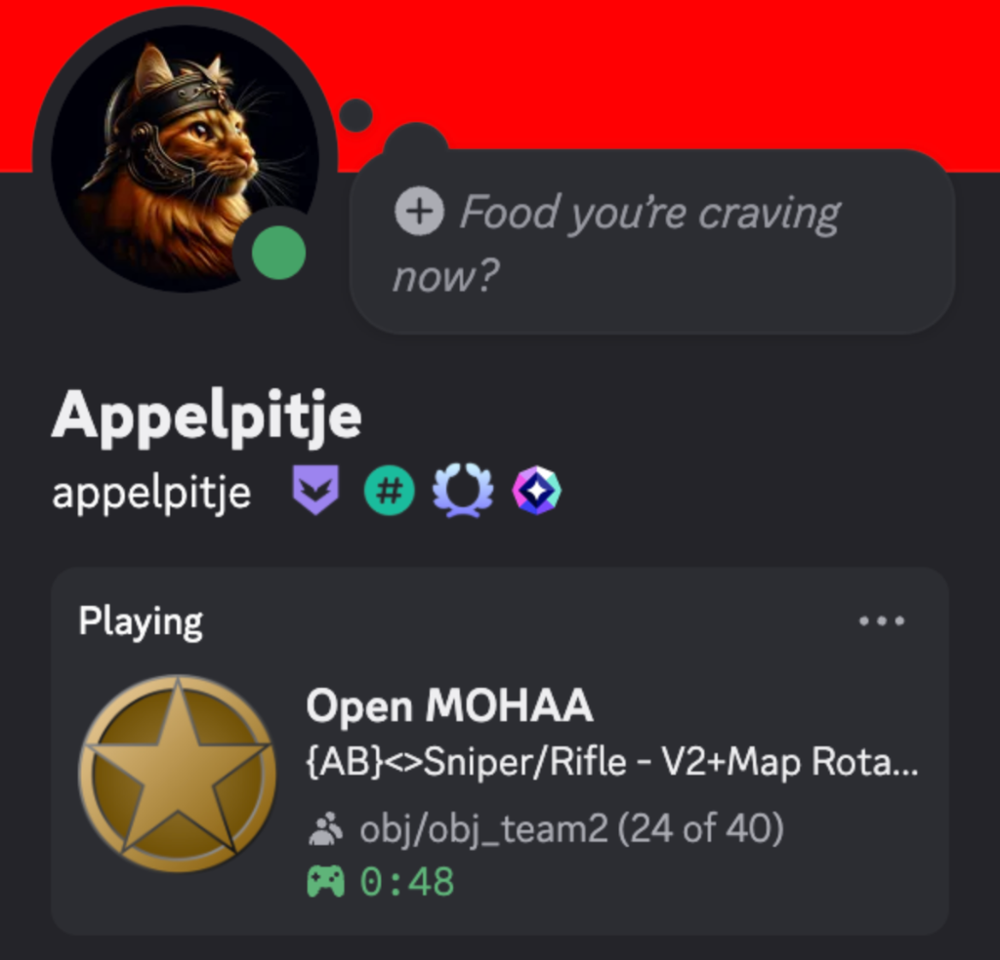
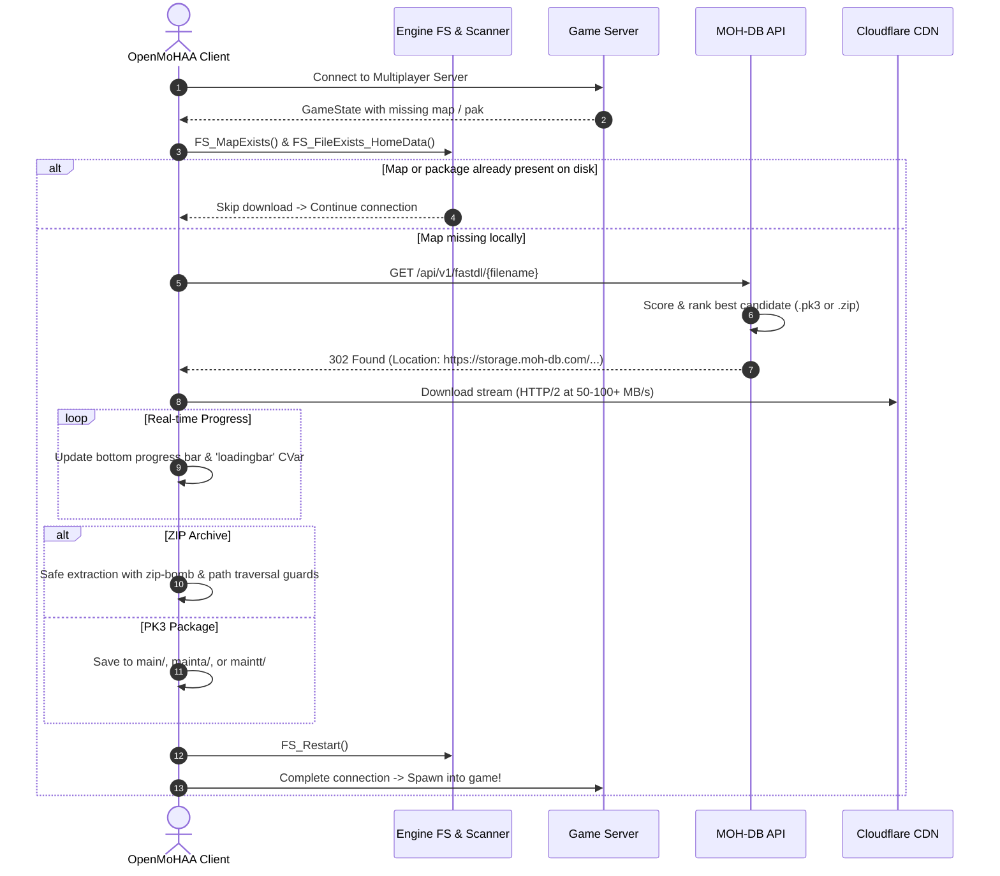

# Fork Features & Changes

This repository is a fork of the official [OpenMoHAA](https://github.com/openmoh/openmohaa) engine project, with additional quality-of-life improvements, Discord integration, and bugfixes.

---

## 1. Discord Rich Presence

Integrated Discord Rich Presence (RPC) support that displays your active game status on your Discord profile. Discord RPC is compiled into the client by default, and disabled at runtime until turned on.

<p align="center">
  
</p>

### Features
- **Single-Player**: Shows current mission and map details.
- **Multiplayer**: Shows current server name, map name, gametype, and real-time player count (`current / max players`).
- **Game State**: Shows elapsed playing time.

### Enabling Discord Rich Presence
You can enable or disable Discord Rich Presence at runtime via the in-game console (`~`) or in your config:

```cfg
set cl_discordRichPresence 1   // Enable Discord Rich Presence
set cl_discordRichPresence 0   // Disable Discord Rich Presence
```

### CVars
| CVar | Default | Values | Description |
|------|---------|--------|-------------|
| `cl_discordRichPresence` | `0` | `0` or `1` | `1` enables Discord Rich Presence reporting to the local Discord client; `0` disables it. Saved to archive config. |

### CMake Build Option
Discord RPC is included in the build by default (`USE_DISCORD_RPC=ON`). To disable compilation of Discord RPC entirely at build time:
```bash
cmake -B build -DUSE_DISCORD_RPC=OFF
```

---

## 2. Multiplayer Chat Management

Allows players to completely disable or toggle in-game multiplayer chat and quick voice chat messages for a cleaner HUD or distraction-free gameplay.

### CVars
| CVar | Default | Values | Description |
|------|---------|--------|-------------|
| `cg_chat` | `1` | `0` or `1` | `1` enables multiplayer chat display and sending; `0` hides all chat, voice messages, and disables the chat console. Saved to archive config. |

### Console Commands
You can run these commands from the in-game console (`~`) or bind them to hotkeys:

- **`chat`** - Toggles multiplayer chat on or off when called without arguments.
- **`chat [0|1|on|off|enable|disable|toggle]`** - Explicitly sets or toggles the chat state.
  - Examples: `chat 0`, `chat off`, `chat enable`
- **`togglechat`** - Quickly toggles chat between enabled (`1`) and disabled (`0`).
- **`enablechat`** - Enables multiplayer chat (`cg_chat 1`).
- **`disablechat`** - Disables multiplayer chat (`cg_chat 0`).

#### Keybind Example:
```cfg
bind F10 "togglechat"
```

---

## 3. Mouse Coordinate Scaling Fix

- **Resolution & Window Scaling**: Fixes mouse coordinate mapping when running in windowed mode, non-native aspect ratios, or on High-DPI / Retina displays.
- Ensures crosshair / cursor positioning matches the exact rendered game view without offset.

---

## 4. Platform & Build Compatibility

- **macOS OpenAL Support**: Updated CMake OpenAL resolution logic to ensure internal OpenAL headers (`alext.h`) are utilized on macOS, avoiding missing header errors when building with AppleClang / Xcode.
- **Universal Architecture Defaults**: Ensures native host architecture (`arm64` on Apple Silicon) is built by default without requiring cross-compilation toolchains.

---

## 5. HTTPS Fast-DL & Automatic ZIP Extraction

Integrated high-speed HTTPS package downloading (Fast-DL) connected directly to the MOH-DB API and global Cloudflare CDN network.

### Architecture Overview



### Features
- **All Expansions Supported**: Automatically detects the active game mode and routes downloads to the correct folder:
  - **Allied Assault (`com_target_game 0`)**: `~/Library/Application Support/openmohaa/main/`
  - **Spearhead (`com_target_game 1`)**: `~/Library/Application Support/openmohaa/mainta/`
  - **Breakthrough (`com_target_game 2`)**: `~/Library/Application Support/openmohaa/maintt/`
- **Intelligent BSP Scanner (`FS_MapExists`)**: Scans all loaded `.pk3` files in memory for any BSP matching the map name (e.g. matching `maps/dm/user_98foucarville.bsp` for `dm/foucarville`), preventing false missing-map triggers.
- **Loop Prevention**: Checks if the package already exists on disk (`FS_FileExists_HomeData`), ensuring packages are never repeatedly re-downloaded.
- **Automated ZIP Extraction**: Downloaded `.zip` archives containing `.pk3` packages are safely unpacked into the target directory with strict path-traversal and zip-bomb security protections.
- **Authentic Bottom Progress Bar**: Displays live download progress, throughput (e.g. `14.2 MB/s`), and byte counts along the bottom of the screen while keeping the original multiplayer connecting screen visible.
- **Multi-tier Download Pipeline**: `sv_dlURL` -> MOH-DB Fast-DL -> UDP Download (if permitted).

### CVars
| CVar | Default | Values | Description |
|------|---------|--------|-------------|
| `cl_fastdl` | `1` | `0`, `1`, or `2` | `1` enables intelligent hybrid fallback (tries server `sv_dlURL` first, then MOH-DB Fast-DL, then UDP); `2` prioritizes MOH-DB Fast-DL first; `0` disables Fast-DL. |
| `cl_fastdl_url` | `https://api.moh-db.com/api/v1/fastdl` | string URL | Base endpoint for Fast-DL package resolution and downloads. |
| `loadingbar` | `0.0` | `0.0` to `1.0` | Read/write progress fraction synchronized during downloads and map loading. |


