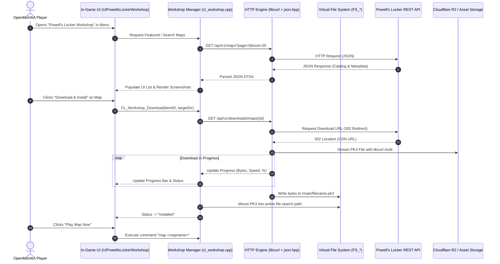

# 🎮 In-Engine "Powell's Locker" Content Browser (In-Game Workshop)
## Technical Design & Implementation Plan for OpenMoHAA

---

## 1. Executive Overview

This specification details the design and step-by-step implementation for an **In-Engine Content Browser & Workshop** for **OpenMoHAA**, seamlessly connected to the **Powell's Locker API** (`api.powellslocker.com`).

### Primary Objectives:
1. **Browse Content In-Game**: Discover, search, and filter community maps, mods, skins, scripts, and sound packs directly within the OpenMoHAA game menu.
2. **One-Click In-Game Downloads**: Download `.pk3` files using non-blocking HTTP requests with live progress feedback, auto-extracting/saving into the proper game directories (`main/`, `mainta/`, or `maintt/`).
3. **Hot-Mounting & Instant Play**: Allow players to immediately load a downloaded map (`map <mapname>`) or enable mods without requiring a game restart.
4. **Console & Headless Support**: Support server admins and power users with CLI console commands (`locker search`, `locker install`, `locker sync`).

---

## 2. Architecture & Data Flow



---

## 3. Technology Stack & Key Dependencies

| Component | Technology | Role |
|---|---|---|
| **Engine Client** | C++17 / C (OpenMoHAA) | Engine runtime, console commands, memory management |
| **Networking** | `libcurl` (embedded in `code/client/cl_curl.c`) | Async HTTP streaming, redirect following, non-blocking transfers |
| **JSON Parser** | `nlohmann::json` (`code/qcommon/json.hpp`) | Parsing API responses into strongly-typed C++ structs |
| **UI Framework** | OpenMoHAA `uilib` (`UIWindow`, `UIListCtrl`, `UIButton`) | In-game menu screens, dialogs, progress bars, textures |
| **VFS** | `FS_OpenFileWrite`, `FS_AddPakFile`, `FS_Restart` | Saving `.pk3` files and mounting them in memory |
| **Backend API** | Spring Boot / Kotlin (`Powell-s-Locker-API`) | REST API for metadata, search, and download redirection |
| **Storage / CDN** | Cloudflare R2 / S3 | Direct fast downloads of `.pk3` packages |

---

## 4. Engine-Side Implementation Details (`openmohaa`)

### 4.1 Data Models & Types (`cl_workshop.h`)

Create `code/client/cl_workshop.h`:

```cpp
#pragma once
#include <string>
#include <vector>
#include <functional>

enum class WorkshopContentType {
    MAP,
    MOD,
    COLLECTION
};

enum class WorkshopDownloadState {
    IDLE,
    FETCHING_URL,
    DOWNLOADING,
    VERIFYING,
    COMPLETED,
    FAILED,
    CANCELLED
};

struct WorkshopItem {
    int64_t id;
    std::string title;
    std::string author;
    std::string version;
    std::string description;
    std::string shortDescription;
    std::string gameType;        // "MOHAA", "MOHSH", "MOHBT"
    std::string contentType;     // "Map", "Skin", "Weapon", "Script", "Sound"
    std::string filename;        // e.g. "obj_omaha_v2.pk3"
    std::string mapName;         // e.g. "obj/obj_omaha_v2" (for direct launching)
    std::string previewImageUrl;
    int64_t fileSize;            // in bytes
    float rating;                // 0.0 - 5.0
    int downloadCount;
    bool isInstalled;
};

struct WorkshopDownloadProgress {
    int64_t itemId;
    std::string filename;
    WorkshopDownloadState state;
    double bytesCurrent;
    double bytesTotal;
    double speedBytesPerSec;
    float percentage;
    std::string statusMessage;
};
```

---

### 4.2 Workshop Core Subsystem (`cl_workshop.cpp`)

Create `code/client/cl_workshop.cpp`:

#### Key Responsibilities:
1. **HTTP Client Wrapper**:
   - `CL_Workshop_FetchCatalog(const char* endpoint, std::function<void(bool, const std::vector<WorkshopItem>&)> callback)`
   - Non-blocking execution integrated into `CL_Frame()` or a background worker thread.
2. **Download Streamer**:
   - Follows HTTP redirects (HTTP 302 from `/api/v1/downloads/...` to Cloudflare R2).
   - Writes directly to disk: `FS_GetBasePath() + "/main/" + item.filename` (or `mainta/`, `maintt/` based on `gameType`).
   - Computes transfer rate and ETA for the UI.
3. **PK3 Hot-Mounting**:
   - When a `.pk3` finishes downloading, invoke `FS_AddPakFile(fullPath)` or reload the pak registry so the engine recognizes the new map/textures/sounds immediately without quitting.
4. **Local Installation Scanner**:
   - Scans `main/`, `mainta/`, `maintt/` to check if `item.filename` already exists locally, marking `isInstalled = true`.

---

### 4.3 Console Commands & CVars

Register the following cvars in `CL_Workshop_Init()`:

| CVar | Default | Description |
|---|---|---|
| `cl_workshop_api_url` | `"https://api.powellslocker.com"` | Base URL for Powell's Locker REST API |
| `cl_workshop_enabled` | `1` | Enable/disable in-game workshop connectivity |
| `cl_workshop_auto_mount` | `1` | Automatically mount newly downloaded PK3 files |
| `cl_workshop_timeout` | `30` | HTTP request timeout in seconds |

Register the following console commands:

```sh
# Search for maps or mods
locker search <query> [map|mod] [mohaa|spearhead|breakthrough]
# Example: locker search omaha map mohaa

# Show trending/featured items
locker featured

# Download and install a specific item
locker install <map|mod> <id>
# Example: locker install map 42

# Download and instantly launch a map
locker play <id>
# Example: locker play 42

# Check active download progress
locker progress

# Cancel an active download
locker cancel

# List locally installed Powell's Locker items
locker list_installed

# Uninstall/delete a workshop PK3
locker remove <filename.pk3>
```

---

### 4.4 In-Game UI Component (`cl_uiworkshop.cpp`)

Implement the UI using OpenMoHAA's `uilib` framework:

#### 1. Layout Design:
* **Top Navigation Bar**:
  * Tabs: `[ Featured ]`, `[ Maps ]`, `[ Mods ]`, `[ Collections ]`, `[ Installed ]`
  * Search Box (`UIField` with real-time submit)
  * Game Version Dropdown (`All`, `Allied Assault`, `Spearhead`, `Breakthrough`)
  * Category Dropdown (`All`, `Skins`, `Weapons`, `Scripts`, `Sounds`, `Utilities`)
* **Left Sidebar / Content Grid (`UIListCtrl`)**:
  * Scrollable list of items displaying: Title, Author, Category badge, File Size, Rating, and "INSTALLED" tag.
* **Right Detail Panel (`UIWindow`)**:
  * **Preview Thumbnail**: Fetched asynchronously and loaded via `R_RegisterShaderNoMip`.
  * **Title & Author Header**
  * **Metadata Table**: Game Type, Version, Size, Download Count, Reborn Compatibility.
  * **Description Box**: Multi-line scrollable text (`UIMLEdit` or `UILabel`).
  * **Action Buttons**:
    * `[ ⬇ Install ]` (if not installed)
    * `[ 🗑 Uninstall ]` (if installed)
    * `[ ▶ Play Map ]` (if installed and is a Map)
    * `[ 🌐 View on Web ]` (opens system browser to `https://moh-db.com/maps/{id}`)
* **Bottom Status & Progress Bar**:
  * Real-time progress bar (`UISlider` or custom drawn quad).
  * Status text: `"Downloading obj_omaha_v2.pk3: 14.5 MB / 32.0 MB (4.2 MB/s) - 4s remaining"`
  * `[ Cancel ]` button.

#### 2. Entry Points in Main Menu:
* Add "Powell's Locker Workshop" button to:
  * `Main Menu` -> `Multiplayer` -> `Workshop`
  * `Main Menu` -> `Custom Content`

---

## 5. Backend API Requirements (`Powell-s-Locker-API`)

The current Spring Boot API already provides most needed endpoints. To maximize performance for the C++ engine client, verify or add these optimizations:

### 5.1 Existing Endpoints Used

1. **Search Maps**:
   ```http
   GET /api/v1/maps?page=0&size=20&mapName={query}&gameType={MOHAA|MOHSH|MOHBT}&sort=id,desc
   ```
2. **Search Mods**:
   ```http
   GET /api/v1/mods?page=0&size=20&modName={query}&typeOfMod={type}&gameType={MOHAA|MOHSH|MOHBT}
   ```
3. **Get Download Redirect**:
   ```http
   GET /api/v1/downloads/maps/{id}
   GET /api/v1/downloads/mods/{id}
   ```
   *(Returns `302 Found` with `Location: https://r2.powellslocker.com/...`)*

4. **Collections Manifest**:
   ```http
   GET /api/v1/collections/{slug}
   ```

### 5.2 Recommended Optimization Endpoint: Workshop Summary

To save memory on the game engine, provide a compact endpoint:

```http
GET /api/v1/workshop/search?q={query}&type={map|mod|all}&gameType={gameType}&page=0&size=20
```

**Compact Response Body (`200 OK`):**
```json
{
  "content": [
    {
      "id": 104,
      "type": "MAP",
      "title": "Omaha Beach Redux",
      "author": "BuilderBob",
      "version": "1.2",
      "gameType": "MOHAA",
      "category": "Objective",
      "filename": "obj_omaha_redux.pk3",
      "mapName": "obj/obj_omaha_redux",
      "fileSizeBytes": 45182900,
      "previewThumbnailUrl": "https://r2.powellslocker.com/thumbs/104.jpg",
      "downloadUrl": "https://api.powellslocker.com/api/v1/downloads/maps/104",
      "rating": 4.8,
      "downloads": 1420
    }
  ],
  "page": 0,
  "totalPages": 12,
  "totalElements": 234
}
```

---

## 6. Phased Implementation Roadmap

### Phase 1: Engine Networking & API Layer
- [ ] Add `code/client/cl_workshop.h` and `code/client/cl_workshop.cpp`.
- [ ] Integrate with `cl_curl.c` for async HTTP GET and 302 redirect handling.
- [ ] Implement JSON deserializer using `code/qcommon/json.hpp`.
- [ ] Test API connectivity against `api.powellslocker.com` on Linux, macOS, and Windows.

### Phase 2: Download Manager & File System Integration
- [ ] Implement streaming file write to disk via safe temporary files (`.pk3.tmp` -> `.pk3`).
- [ ] Implement download progress calculations (speed, ETA, percentages).
- [ ] Add PK3 hot-mounting (`FS_AddPakFile` or dynamic pak directory scan).
- [ ] Add local installation scanner to match existing `.pk3` files in `main/`.

### Phase 3: Console Commands & Scripting
- [ ] Implement console commands: `locker search`, `locker install`, `locker play`, `locker cancel`, `locker list_installed`.
- [ ] Add automatic map launching: after download completes, automatically run `map <mapName>`.

### Phase 4: In-Game UI Window (`uilib`)
- [ ] Implement `code/client/cl_uiworkshop.cpp` (`UIPowellsLockerWorkshop`).
- [ ] Build layout: Tabs, search bar, item list, detail panel, and progress footer.
- [ ] Implement asynchronous preview image loading into OpenGL texture memory.
- [ ] Connect UI events (`EV_Install`, `EV_PlayMap`, `EV_FilterChanged`).
- [ ] Link Workshop menu entry into main game menus.

### Phase 5: FastDL Auto-Resolver & Collection Sync
- [ ] Implement `locker sync <collection-slug>` to download all assets from a curated collection.
- [ ] Integrate with server join sequence: if missing a map when connecting to an OpenMoHAA server, automatically prompt to download from Powell's Locker.

---

## 7. Verification & Testing Matrix

| Test Case | Procedure | Expected Result |
|---|---|---|
| **1. API Connectivity** | Run `locker featured` in console. | Top featured maps are listed with IDs, names, and file sizes. |
| **2. Search Query** | Run `locker search stalingrad map mohaa`. | Matching maps are returned and paginated correctly. |
| **3. Download & Progress** | Run `locker install map <id>`. | Progress bar advances, file saves to `main/`, no engine stutter or freezing. |
| **4. Hot-Mount & Launch** | Run `locker play <id>`. | Map downloads (if missing), mounts, and engine loads map directly via `map <name>`. |
| **5. Network Disconnection** | Disconnect network during active download. | Engine gracefully reports error, cleans up `.tmp` file, and UI resets state. |
| **6. Image Rendering** | Open Workshop UI window. | Thumbnail preview images load and render crisply without memory leaks. |
| **7. Cross-Platform** | Build on Windows (MSVC), macOS (AppleClang), and Linux (GCC/Clang). | Builds cleanly with zero warnings and runs identically across all platforms. |

---

## 8. File Modification Summary

### OpenMoHAA Repository (`openmohaa`):
- `[NEW]` `code/client/cl_workshop.h` — Core Workshop header, data structures, and declarations.
- `[NEW]` `code/client/cl_workshop.cpp` — Networking, cURL worker, JSON parser, download management, and console commands.
- `[NEW]` `code/client/cl_uiworkshop.h` — UI Widget definitions for the Workshop window.
- `[NEW]` `code/client/cl_uiworkshop.cpp` — UI rendering, event dispatching, and thumbnail shader binding.
- `[MODIFY]` `code/client/cl_main.cpp` — Initialize and tick Workshop subsystem in `CL_Init()` and `CL_Frame()`.
- `[MODIFY]` `code/client/CMakeLists.txt` — Add new source files to the client build target.

### Powell's Locker API (`Powell-s-Locker-API`):
- `[NEW/MODIFY]` `com/powellslocker/content/workshop/WorkshopController.kt` — (Optional) Compact summary endpoint for low-bandwidth in-game querying.
